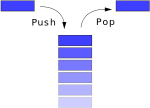

# DataStructure
Data Structure
=================

1.Stack
--------

 - LIFO(Last In First Out)구조,  즉 제일 마지막에 push 한 data가 pop할 때 먼저 나오게 된다.

 - 예를 들면 프로세스의 context switching시나, 함수 호출 시, 인터럽트 발생 시 현재 수행중인 주소를 스택에 넣은 뒤 다음 함수로 진입 후, 복귀할 때 스택에서 다시 이전의 주소로 돌아옴.

 - 고정크기의 배열을 주로 사용하며, 크기 제한을 없애기 위해서는 연결리스트로 구현하면 가능하다.
 - push 할때는 인덱스를 증가시킨 뒤에 값을 넣고 pop할 때에는 값을 꺼내온 다음 인덱스연산을 하는 것을 주의.
 - (과자 다이제스트 처럼 한쪽 구멍이 막혀있는 통에 하나씩 물건을 쌓고 다시 빼는 것을 상상하면 쉽다.)

int MyStack::push(int _data)
{
	if(pos >= MaxBufferSize)
	{
		cout<<"Stack is full !!!!"<<endl;
		return 0;
	}
	++pos;
	buffer[pos] = _data;
	return 1;
}

int MyStack::pop()
{
	int ret = 0;

	if(pos < 0)
	{
		cout<<"Stack is empty!!!!"<<endl;
		return 0;
	}

	ret = buffer[pos];
	pos--;

	return ret;
}

2.Queue
--------

- FIFO구조(First In First Out)로 먼저 넣은 것이 먼저 나오는 자료구조.
- EnQueue때에는 rear++, DeQueue때에는 front++
- 스택이 윗 뚜껑만 열려있는 원통이라고 하면, 큐는 양쪽 구멍이 모두 뚤려있는 원통이라고 상상하면 이해가 쉬움.
- 계속 넣고 빼다 보면 index가 배열의 끝으로 이동하기 때문에 다시 init을 해주어야 한다.
- 그래서 대부분 원형 큐를 많이 사용한다. 이전의 스택과 지금의 큐 모두 고정 크기의 배열을 사용한다.
- 크기 제한이 없이 사용하기 위해서는 연결리스트를 이용한 큐를 사용하면 됨.
- 비었을 경우는 front와 rear가 같을 때, 꽉찬경우는 rear+1이 front와 같을 때로 판단함.

int CircularQueue::isEmpty(void)
{
	if(front == rear)	return 1;
	else return 0;
}

int CircularQueue::isFull(void)
{
	//if(front == rear) return 1;
	if((rear+1) % size == front) return 1;
	else return 0;
}

https://github.com/unlocker-sy/DataStructure

